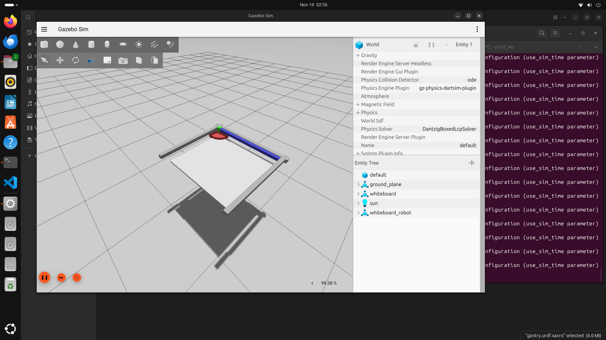
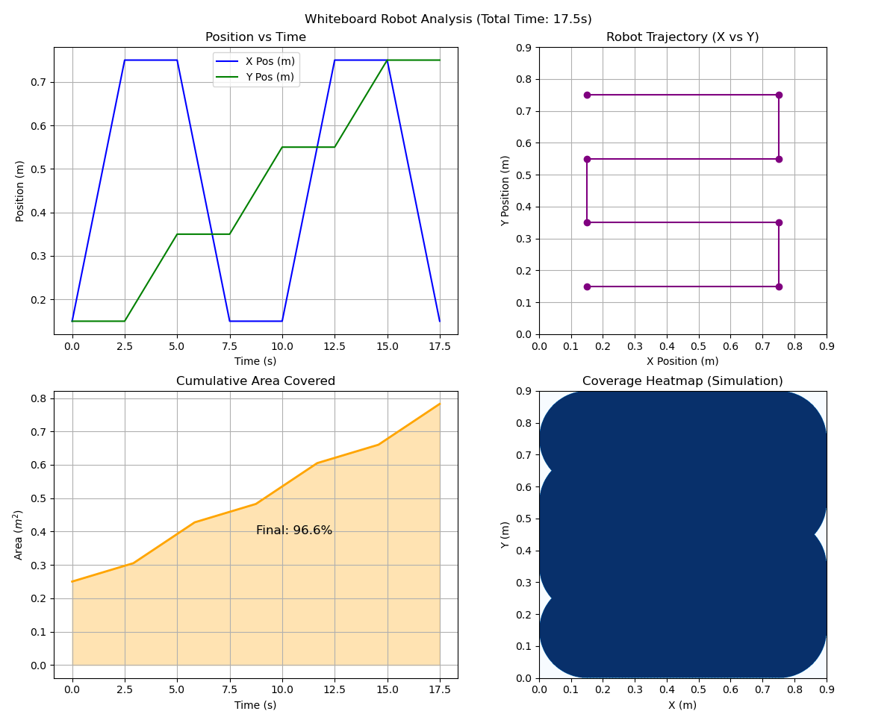

# Whiteboard Cleaning Robot Simulation

This project simulates a 3-DOF Cartesian robotic manipulator designed to clean a $90 \times 90$ cm whiteboard. It uses ROS 2 Jazzy for control and Gazebo Harmonic for physics simulation.

**Authors:** Galaba Vamsi & Gajanand Kumawat

**Project:** Problem Statement 2 - Whiteboard Cleaning Manipulator

## Overview



The robot features:

- X-Axis: Prismatic gantry (Horizontal movement)
- Y-Axis: Prismatic carriage (Vertical movement)
- Z-Axis: Continuous revolute duster (Spinning cleaning tool)

It performs an automated raster scan (lawnmower) path with 10cm overlap to ensure 100% coverage.

## Video Demonstration

[Video Link](https://drive.google.com/file/d/1fd4h1i0jYtIyKteSKLBSPGodQrlZ6nuv/view)

## Prerequisites

- Ubuntu 24.04 LTS
- ROS 2 Jazzy
- Gazebo Harmonic
- ros-jazzy-ros-gz bridge packages
- ros-jazzy-gz-ros2-control
- Python 3 with matplotlib (for analysis graphs)

## Installation

Clone or Download this repository into your ROS 2 workspace source folder (e.g., `~/ros2_ws/src/`).

Install Dependencies:

```bash
sudo apt update
sudo apt install ros-jazzy-desktop ros-jazzy-ros-gz ros-jazzy-gz-ros2-control python3-matplotlib
```

## How to Run

### Option 1: The Easy Way (One Script)

We have provided a shell script to build the workspace, launch the simulation, and start the robot automatically.

Make the script executable:

```bash
chmod +x run_all.sh
```

Run it:

```bash
./run_all.sh
```

### Option 2: Manual Execution

**Terminal 1: Build & Launch Simulation**

```bash
cd ~/ros2_ws
colcon build --packages-select whiteboard_robot
source install/setup.bash
ros2 launch whiteboard_robot simulate.launch.py
```

Wait for Gazebo to open and the robot to appear. Ensure the Play button is pressed.

**Terminal 2: Run Cleaning Node**

```bash
cd ~/ros2_ws
source install/setup.bash
ros2 run whiteboard_robot cleaner_node
```

## Simulation Analysis

After the robot finishes its path, a file named `cleaning_data.csv` will be generated in your workspace root. To visualize the results (Coverage Heatmap, Trajectory):

```bash
cd ~/ros2_ws
python3 analyze_results.py
```

This will generate `robot_analysis_report.png`.



## Project Structure

- `urdf/`: Robot description (Xacro/URDF)
- `launch/`: Python launch files for Gazebo & ROS 2
- `config/`: Controller configuration (YAML)
- `world/`: Gazebo environment (Whiteboard, Lighting)
- `whiteboard_robot/`: Python control node source code
